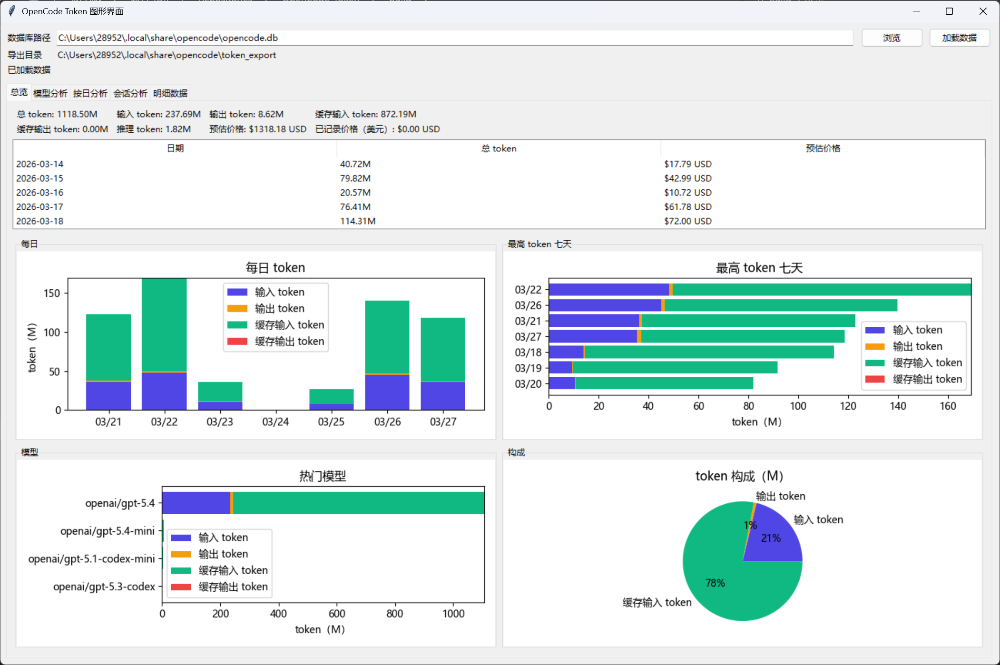

# OpenCode Token

OpenCode Token 是一个面向 `opencode.db` 的 Python 工具仓库，用来分析消息与 token 使用情况，并以 **GUI 浏览** 和 **CLI 导出** 两种方式提供结果。



## 功能概览

- 从 OpenCode SQLite 数据库读取消息、token 和已记录成本
- 聚合总览、模型、会话、日期四类统计
- 支持内置价格表、本地价格覆盖、会话分层定价
- 对多币种预估成本分别汇总，避免错误相加
- 导出 UTF-8 BOM CSV，便于直接用 Excel 打开
- 提供桌面 GUI 浏览汇总卡片、图表和分页明细

## 开发环境安装

建议使用 Python 3.11+。

以下方式主要用于源码调试、开发和本地验证。

仅安装运行依赖：

```bash
python -m pip install .
```

安装开发依赖：

```bash
python -m pip install -e .[dev]
```

## 使用方式

### 1. 从 Release 下载 exe 直接运行

普通使用建议直接前往 [Releases 页面](https://github.com/Sakura1618/OpenCode-Token/releases/latest) 下载 `opencode_token_gui.exe`。

下载后直接双击运行即可，默认数据库路径为：

`%USERPROFILE%\.local\share\opencode\opencode.db`

如果你的数据库不在默认位置，可以在 GUI 顶部点击“浏览”手动选择 `opencode.db`。

### 2. 从源码启动 GUI（开发使用）

```bash
python opencode_token_gui.py
```

或者在安装后使用控制台命令：

```bash
opencode-token-gui
```

源码启动时，默认数据库路径同样为：

`%USERPROFILE%\.local\share\opencode\opencode.db`

### 3. 通过命令行导出 CSV

```bash
python export_opencode_tokens.py <opencode.db路径> [输出目录]
```

或者在安装后使用：

```bash
opencode-token-export <opencode.db路径> [输出目录]
```

未指定输出目录时，默认写入数据库同级目录下的 `token_export/`。

## 价格机制

- 内置价格表：`opencode_token_app/prices.json`
- 本地覆盖文件：入口文件同目录下的 `prices.local.json`
- 支持 flat pricing 与 session-tiered pricing
- 当存在多币种时，统一使用 `estimated_cost_totals` 表达分币种总额

## 当前仓库结构

```text
.
├─ opencode_token_app/       # 核心源代码包
├─ tests/                    # 自动化测试
├─ docs/                     # 工程与维护文档
├─ scripts/                  # 维护者便利脚本（不进入发布包）
├─ export_opencode_tokens.py # CLI 入口
├─ opencode_token_gui.py     # GUI 入口
├─ opencode_token_gui.spec   # PyInstaller 构建规格
├─ pyproject.toml            # 项目元数据与工具配置
├─ README.md
├─ LICENSE
└─ CHANGELOG.md
```

## 开发与验证

运行测试：

```bash
python -m pytest
```

构建 Windows 单文件 GUI：

```bash
scripts\build.bat
```

更多信息见：

- `docs/architecture.md`
- `docs/development.md`
- `docs/release.md`
- `CONTRIBUTING.md`

## 发布边界

本仓库刻意区分三类内容：

1. **源码基线**：源码、测试、正式文档、项目元数据
2. **维护者工具**：`scripts/` 下的本地辅助脚本
3. **生成物**：`build/`、`token_export/`、缓存文件、本地价格覆盖

其中：

- `.gitignore` 负责忽略本地生成物和缓存
- `.gitattributes` 负责在 `git archive` 导出时排除 `tests/`、`docs/`、`build/`、`token_export/`、`scripts/`

如果你手工压缩工作区进行发布，需要自行排除这些路径。
